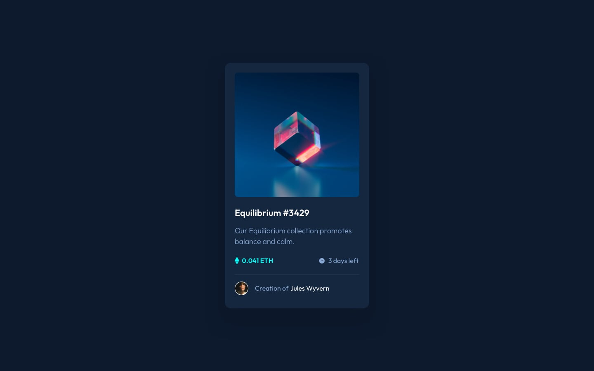
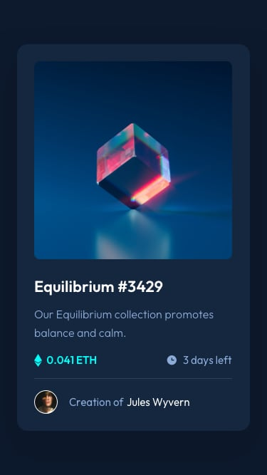
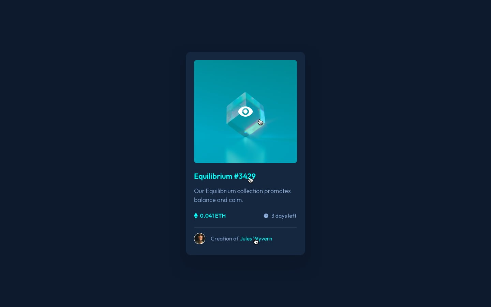

# NFT preview card component - Frontend Mentor

<b>Esta é uma solução para o desafio do site Frontend Mentor, que desenvolve habilidades de HTML e CSS</b>

## Visão Geral 

###  Projeto 
<b>O objetivo é desenvolver uma página de cartão com componentes.

###  Desafio

<b>O desafio consiste é desenvolver uma página de cartão com componentes, partir dos designs e funcionalidades fornecidas. 

### Funcionalidades 
<ul>
<li>Visualizar o layout ideal para o aplicativo, dependendo do tamanho da tela do dispositivo;</li>
<li>Ver os estados de foco de todos os elementos interativos na página.</li>
</ul>

### Capturas de tela 

Preview:  
  
     
Preview-mobile:   

    
Preview com elementos interativos:  
  
  
    

### Links 
<ul>
<li><a href="https://github.com/fernanda-nunes/nft-card-frontend-mentor" target="_blank">Repositórios</a></li>
<li><a href="https://fernanda-nunes.github.io/nft-card-frontend-mentor/" target="_blank">Site ao vivo</a></li>
</ul>

## O que eu aprendi 

<b> Durante o desenvolvimento deste projeto, tive a oportunidade de consolidar e expandir minhas habilidades em desenvolvimento front-end.
